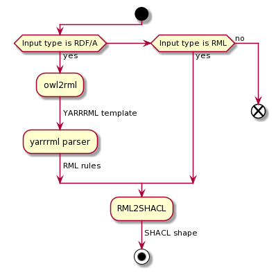
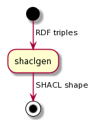

# Prerequisite 

For the evaluation we require the following helper tools to help 
with the creation of the RML mapping (if there is none) from which
the shapes will be generated. 


* [Owl2rml](https://github.com/oeg-dataintegration/owl2rml): generates YARRRML template from the input ontology. 
* [YARRRML parser](https://github.com/RMLio/yarrrml-parser): generates RML rules from YARRRML template. 


The target tool with which we will compare is 
[shaclgen](https://github.com/uwlib-cams/shaclgen).


#General evaluation workflow

The script requires RML mapping file to generate SHACL shapes. 
In the case where RML mapping file is not available, the ontology 
file provided with the benchmark tools will be used to generate the 
equivalent RML mapping file for SHACL shape generation. 


The following diagram describes the workflow of our evaluation in 
such a case:

**RML2SHACL**'s workflow: 



Unlike **RML2SHACL** which generates SHACL shapes from RML mapping files, 
**shaclgen** generates them from RDF triples. 
The following diagram describe its workflow. 

**Shaclgen**'s workflow:




#Validation of the generated shapes 

The generated shape graphs are validated using the SHACL shapes provided by 
[W3C](https://www.w3.org/TR/shacl/#shacl-shacl). 


#Test cases 

To evaluate **RML2SHACL**, we devised the following test cases which evaluate 
the quality of the generated shapes and the execution time of **RML2SHACL**. 


##RML test cases 
RML test cases can be evaluated as simply as just running the evaluation 
script without arguments: 
These test cases are used for shape quality evaluation whether a shape is 
generated "sucessfully". 

```
python3 evaluation/rml2shacl_eval.py
```

This will generate a file **ResultsFinal3.csv** which summarizes whether 
**RML2SHACL** fails/succeeds in generating a valid SHACL shape graph. 

## BSBM test cases
BSBM requires data to be generated using the script provided by their 
[repository](https://sourceforge.net/projects/bsbmtools/). 
We also provide a helper script ``data_generator.sh`` to generate 
data in steps of 1000 triples until 10000 triples. 
You'll have to first copy the provided ``data_generator.sh`` script into
the root folder of the BSBM's repo for data generation. 

For these test cases, we are evaluating the evaluation time of **RML2SHACL** 
against **shaclgen**. 

Running **RML2SHACL** is simple as: 
```
python3 evaluation/rml2shacl_eval.py -f evaluation/bsbm/mapping.ttl 

```

For **shaclgen**, you'll have to run the following for each dataset generated. 
```
python3 evaluation/shaclgen_eval.py [evaluation/... dataset.ttl]

```

## Astrea test cases
Astrea test cases are meant to evaluate the quality of our generated shape 
graphs with the provided reference shape graph describing their ontology.

Each of the astrea test cases is located under the `astrea_test/` folder. 
Since the test cases have no RML mapping rules available, you'll have to 
generate the RML rules using the aforementioned 
[workflow](#general-evaluation-workflow).

